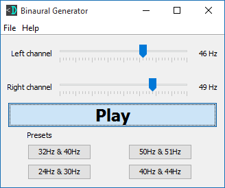

Binaural Generator
==================

Generate custom binaural beats with a GUI.

Download the JAR
----------------
[Binaural Generator from DevDungeon.com](http://www.devdungeon.com/content/binaural-beat-generator)

Source Code
-----------
[Binaural Generator (GitHub.com)](https://www.github.com/DevDungeon/BinauralGenerator)

Running
-------
* Ensure Java 7 or greater is installed
* Double click the .jar file or run at the command line with:

`java -jar BinauralGenerator-1.0.jar`

Links
-----
* [Binaural Generator Project Page (DevDungeon.com)](http://www.devdungeon.com/content/binaural-beat-generator)
* [Binaural Beats with Java Programming Tutorial](http://www.devdungeon.com/content/binaural-beats-java)
* [Binaural Beats (Wikipedia)](https://en.wikipedia.org/wiki/Binaural_beats)
* [Brainwave Entrainment (Wikipedia)](https://en.wikipedia.org/wiki/Brainwave_entrainment)

Brainwave Frequencies
---------------------
* Gamma, 30 to 50 Hz
* Beta,  14 to 30 Hz
* Alpha, 8 to 14 Hz
* Theta, 4 to 8 Hz
* Delta, 0.1 to 4 Hz

Contact
-------
NanoDano <nanodano@devdungeon.com>

License
-------
GNU General Public License, version 2 (See LICENSE.txt)

Changelog
---------
v1.0 - 2016/10/20 - Initial stable release.
